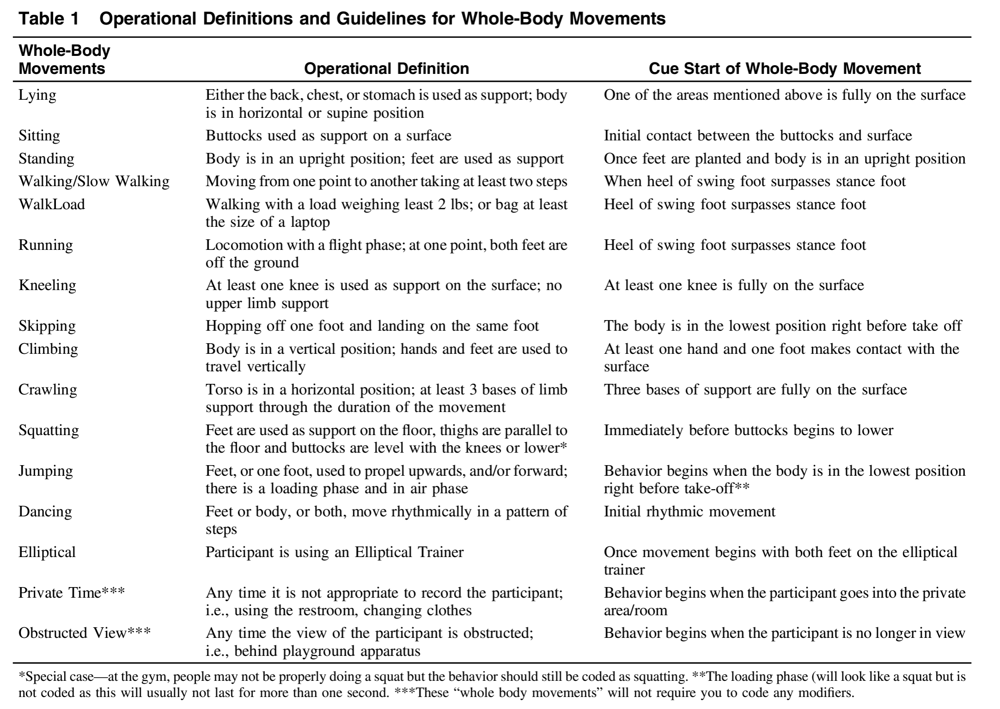
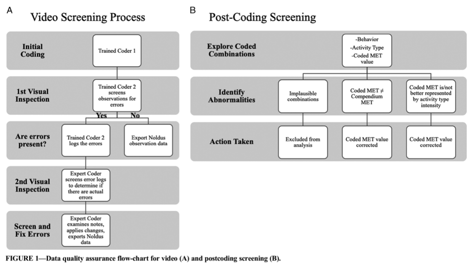

The purpose of the Movement Observation in Children and Adolescents Study (MOCA) and miniMOCA studies is to develop methods for processing activity tracker data so we can more accurately measure physical activity levels across a wide age range of youth (6 months to 25 years old). To accomplish this, each child is videotaped in several natural settings (home, playground/sports/activity class, in the community, and in school) while wearing two activity trackers (one on the wrist and one on the hip).

# Brief description of the MOCA DO system from Cox et al. (JMPB, 2020)

The direct observation (DO) system was developed and implemented using the ObserverXT (OXT) (Noldus Information Technology, Inc., Wageningen, Netherlands) computer software to code video observations. Prior to any data collection, the DO system was developed using the previously mentioned adult DO systems as a template (Lyden, Petruski, et al., 2014). The first author (expert coder) took the lead on developing the DO system, with regular input provided by the research team.

The DO system uses focal sampling and includes codes for four main outcomes. For this focal sampling protocol, a new event is recorded each time a participant changes a component of their movement for at least one second. The main outcomes included whole-body movement, locomotion, activity type and the metabolic equivalent (MET) value for the whole-body movement. The whole-body movements include 12 options for different movements and postures. The final operational definitions are provided in Table 1. The other three outcomes (i.e., modifiers) include locomotion, activity type, and MET value. Locomotion is a binary “Yes” or “No” modifier that specifies if the participant moved from an initial position to another position with at least two steps. Activity type has several options for the context of the movement (e.g. running as whole-body movement with soccer as the activity type). The MET values in the pilot phase (child participants) were originally based on the MET values from the Compendium of Energy Expenditures in Youth corresponding with each whole-body movement (Ridley, Ainsworth, & Olds, 2008) and then updated using the most recent Youth Compendium of Physical Activities for children 6 to 17 years of age (Butte et al., 2017).  The MET value modifier for the young adult sub-sample (Phase III) was based on the Compendium of Physical Activities (Ainsworth et al., 2011). The options within each modifier were mutually exclusive and required for every new event.  

# DO and accelerometer data alignment from Marcotte et al. (MSSE, 2020)

## Direct Observation 

Direct observation of the participant served as the criterion measure. At the beginning of each session, participants were asked to remain stationary for 15-30 seconds. At the beginning of the stationary period, a video recording with a GoPro was started, with the participant and current time visible in the camera’s viewing field, and the video start time was recorded. The same laptop used to initialize the ActiGraph devices was also used to display the current time to ensure synchronization between the video and ActiGraph timestamps. When starting the camera, there is a slight delay between activating the recording and the actual recording. Thus, the 15- to 30-second delay between the video and session start times was included to account for any asynchrony between the video and accelerometer timestamps and ensure alignment of the data. The session began at the end of the stationary period at which time participants began their normal activities and the session start time was recorded. 

After field-based data collection, video files were imported into the Noldus Observer XT software (version 14; Noldus Information Technology, Inc, Leesburg, VA) for direct observation coding. Direct observation coding using the Noldus Observer XT software has been used in previous accelerometer calibration and validation studies. The coding system used in the current study is an extension of the focal sampling coding system used by Lyden et al., where a new observation or event is coded each time the observed individual changes to a different activity.  Direct observation video coding was performed by trained research assistants who achieved at least 80% reliability with an expert coder using the MOCA method. Briefly, the MOCA direct observation coding system requires the coding of distinct body movements and behaviors that last at least 1-second in duration by assigning the following variables to each coded event: whole body movement or posture, activity type, MET value (based on the whole body movement or activity type), and locomotion (binary classifier). For example, an individual who is sitting while lifting weights would be coded as follows: sitting for the whole-body posture, lifting weights for the activity type, 4.3 METs, and no for locomotion. All activity types and corresponding MET values were derived from the Compendium of Physical Activities.  

The activity type variable serves as a contextual descriptor to the observed behaviors, however there are periods when the participant is not engaging in the coded activity type. Using the aforementioned example, the participant may be in the context of lifting weights, but there are rest periods when the participant is not actively interacting with the weights. During these periods, all of the coded variables would remain the same except for the coded MET value, which would be coded as 1.3 METs during the rest period instead of 4.3 METs during the active lifting weights period.  

To ensure reliability and consistency across coded observations, each video file was extensively inspected (Figure 1). Coded observations were initially visually inspected for errors by a trained coder who was different from the original coder. If there were no errors identified in the coded observations, the observation data were exported from the Noldus Observer software. Otherwise, the coder identified and recorded details on the errors associated with the coded observations. Then, a third expert coder inspected the video, added comments if additional errors were found, and verified whether errors identified in the first visual inspection were valid or not. Finally, an expert coder examined the errors recorded from both rounds of visual inspection to amend the coded observations prior to exporting the data. 

After data were exported, all coded combinations of behavior, activity type, and MET value were visually inspected by three trained research assistants (RM, MC, GP). Coded combinations were examined for incompatible whole-body movement and activity-type pairs (e.g. sitting while standing), coded MET values that didn’t match the compendium MET values for either the behavior or activity type, or coded MET values did not follow the MOCA coding scheme rules (i.e. coded MET value will be associated with the behavior unless the activity type better represents the intensity level). Of the 9,677.2 total observation minutes, 283.9 minutes (2.9%) contained coded MET value abnormalities which were corrected to the proper MET values. There were 4.9 minutes (0.05%) that contained incompatible behavior and activity type combination errors which were excluded from the analyses. 

## Data Processing 

Direct observation files (output from the video coding process) were imported and processed using custom R functions. Direct observation timestamps were converted to hundredths of seconds to allow for identification of the main body movement and activity type coded for the majority of a 1-second window. The main body movement and activity type coded for the majority of each 1-second window (>0.5 seconds) were recorded as the criterion behavior and activity type for that second.  
